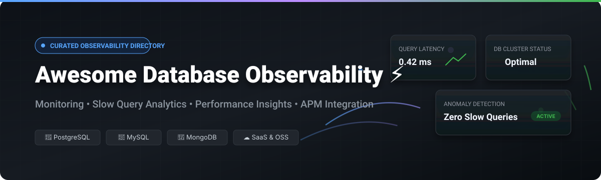

# ⚡ Awesome Database Observability

  

  
  
  
  
  

> 📊 **Curated List of SaaS Platforms & Open-Source Tools for Database Monitoring, Query Analytics, Performance Insights & Database Health Observability.**  
> *Last updated: October 2026*

---

## 💡 Overview & Market Insights

Database observability tools help DBAs, Site Reliability Engineers (SREs), DevOps teams, and platform engineers monitor database health, detect query anomalies, analyze wait events, tune indexes, and correlate database performance with distributed application traces.

### 🌐 Market Analysis & Industry Fragmentation
> [!NOTE]
> 📈 **Estimated Market Size & Industry Dynamics:**  
> The global Database Observability and APM market is estimated at **$5.2 Billion - $6.5 Billion** (2026), growing at a ~16% CAGR driven by cloud-native migration, multi-cloud complexity, and automated query optimization demands. The market is **moderately fragmented**: enterprise platform giants (*Datadog, Dynatrace, New Relic, IBM/Instana*) dominate unified full-stack observability, while specialized database performance leaders (*Redgate, Percona, SolarWinds, pganalyze*) capture deep database-native query analytics and DBA workflows.

---

## 📑 Table of Contents

- [☁️ SaaS / Hosted Platforms](#-saas--hosted-platforms)
- [🔓 Open-Source GitHub Projects](#-open-source-github-projects)
- [📈 Star History](#-star-history)
- [🤝 Support & Sponsorship](#-support--sponsorship)
- [🤝 How to Contribute](#-how-to-contribute)
- [⚠️ Disclaimer](#%EF%B8%8F-disclaimer)

---

## ☁️ SaaS / Hosted Platforms

Below is a curated table of commercial SaaS and hosted database monitoring platforms, sorted by **company scale (valuation / estimated market capitalization / revenue)** in descending order:

| 🏢 Platform / Product | 📏 Scale (Valuation / Revenue) | 💵 Starting Tier Price | 🎁 Free Tier / Trial Limits | 🔍 Core Focus & Description |
| :--- | :--- | :--- | :--- | :--- |
| **[Datadog Database Monitoring](https://www.datadoghq.com/product/database-monitoring/)** | **~$96.5B Market Cap** ($3.97B Annual Revenue) | **$70 / database host / month** | **14-day free trial** with full platform access (Free plan excludes DBM) | Cloud-native DBM providing query-level metrics, execution plans, wait event analysis for Postgres, MySQL, Oracle, MongoDB. |
| **[Dynatrace Database Insights](https://www.dynatrace.com/)** | **~$16.7B Market Cap** ($2.1B Annual Revenue) | **$0.08 / host-hour** (~$58/month) for Davis AI observability | **15-day free trial** with no credit card required | Full-stack AI-powered observability with automatic database topology discovery, root cause analysis, and query profiling. |
| **[New Relic Database Monitoring](https://newrelic.com/)** | **~$6.5B Valuation** ($1.0B Revenue) | **$49 / compute unit / month** (Standard tier) | **100 GB/month free forever** data ingest (1 full user free) | APM platform providing database query-level metrics, execution plan analysis, and correlated trace dashboards. |
| **[SolarWinds Database Performance Analyzer (DPA)](https://www.solarwinds.com/database-performance-analyzer)** | **~$4.4B Valuation** ($797M Revenue) | **$1,195 per database instance** (Perpetual / Annual option) | **14-day free trial** with full feature access | Query-level wait-time monitoring, index tuning recommendations, blocking/deadlock analysis for Oracle, SQL Server, MySQL, Postgres. |
| **[Instana Database Monitoring (IBM)](https://www.instana.com/)** | **Acquired by IBM** ($2.2B+ IBM Software division segment) | **$75 / host / month** (billed annually) | **14-day free trial** with full automated discovery capabilities | Automated APM and database monitoring providing query performance analysis and real-time distributed tracing. |
| **[Quest Foglight](https://www.quest.com/foglight/)** | **Est. ~$2.2B Valuation** (~$1.0B Revenue) | **~$1,500 / monitored database instance** | **30-day free trial** for enterprise evaluation | Cross-platform enterprise database performance monitoring with SQL PI (Performance Investigator) for deep wait-time analysis. |
| **[pganalyze](https://pganalyze.com/)** | **Private / VC-backed** (Est. $10M–$20M ARR) | **$149 / month** (Production plan, 1 server) | **14-day free trial** (Open-source collector available for self-hosting) | Specialized PostgreSQL performance monitoring platform featuring automated index recommendations and query optimization. |
| **[Redgate Monitor](https://www.red-gate.com/products/monitor/)** | **~$100M ARR** (Private Equity Backed) | **$1,675 / server / year** | **14-day free trial** (Free tier for 1 local server on community edition) | The enterprise monitoring standard for SQL Server estates and PostgreSQL, offering real-time alerts, deadlock analysis, and capacity planning. |
| **[EverSQL](https://www.eversql.com/)** | **Private** (Bootstrapped / High Growth) | **$125 / year** (Basic paid tier) | **Free tier available** (up to 1 free query optimization request per month) | AI-powered SQL query optimization engine delivering automatic indexing and rewrite recommendations for MySQL & Postgres. |
| **[DBmarlin](https://www.dbmarlin.com/)** | **Private** (Application Performance Ltd) | **$600 / database instance / year** | **1 free starter license forever** for 1 database instance | Multi-database performance monitoring focusing on database wait events, SQL change tracking, and microsecond-level query analysis. |
| **[Database Lab (Postgres.ai)](https://postgres.ai/)** | **Private / VC-backed** | **$99 / month** (Standard SaaS control plane) | **14-day free trial** (Engine is open-source for self-hosting) | PostgreSQL database branching and thin cloning enabling instant copy of multi-TB databases for query testing and troubleshooting. |
| **[PlanetScale Insights](https://planetscale.com/)** | **Private / VC-backed** | **$39 / month** (Scaler plan) | **14-day free trial** on paid plans | Deep MySQL performance monitoring and query insights built directly into the Vitess-based PlanetScale cloud platform. |
| **[dbWatch](https://www.dbwatch.com/)** | **Private** | **$300 / instance / year** (Control tier) | **30-day free trial** for enterprise monitoring | Enterprise database control center for monitoring and managing large heterogeneous database fleets (Oracle, SQL Server, Postgres, MySQL). |

---

## 🔓 Open-Source GitHub Projects

The open-source database observability ecosystem is production-proven and widely adopted. Below is a comprehensive list of open-source projects, sorted by **GitHub Star Count (descending)**.

| 📦 Project & Repository | ⭐ Stars | 📜 License | 🎯 Category / Tech | 📝 Description |
| :--- | :--- | :--- | :--- | :--- |
| **[Netdata](https://github.com/netdata/netdata)** |  | `GPL-3.0` | Multi-DB / Infrastructure | Real-time, high-resolution database and infrastructure monitoring agent with auto-discovered dashboards for MySQL, Postgres, MongoDB, Redis. |
| **[VictoriaMetrics](https://github.com/VictoriaMetrics/VictoriaMetrics)** |  | `Apache-2.0` | Time-Series / Observability | Fast, cost-effective time-series database and monitoring solution frequently used as the storage backbone for database metric exporters. |
| **[MySQLTuner-perl](https://github.com/major/MySQLTuner-perl)** |  | `GPL-3.0` | MySQL / MariaDB | The classic CLI-based MySQL performance analysis script. Analyzes memory, query cache, index usage, and provides configuration recommendations. |
| **[PgHero](https://github.com/ankane/pghero)** |  | `MIT` | PostgreSQL | Lightweight, read-only PostgreSQL performance dashboard offering query analysis, index bloat detection, and active connection monitoring. |
| **[Coroot](https://github.com/coroot/coroot)** |  | `Apache-2.0` | eBPF / Cloud-Native | eBPF-based zero-instrumentation observability platform providing automatic database query performance analysis for Postgres, MySQL, and Redis. |
| **[Postgres Exporter](https://github.com/prometheus-community/postgres_exporter)** |  | `Apache-2.0` | PostgreSQL / Prometheus | Official Prometheus exporter for PostgreSQL server metrics, table statistics, lock metrics, and custom query metrics collection. |
| **[Database Lab Engine](https://github.com/postgres-ai/database-lab-engine)** |  | `AGPL-3.0` | PostgreSQL / Cloning | Open-source technology for instant thin cloning of multi-terabyte PostgreSQL databases to investigate slow queries and test migrations safely. |
| **[MySQLd Exporter](https://github.com/prometheus/mysqld_exporter)** |  | `Apache-2.0` | MySQL / Prometheus | Prometheus exporter for MySQL and MariaDB server performance schema metrics, InnoDB status, and slow query log counts. |
| **[pgwatch2](https://github.com/cybertec-postgresql/pgwatch2)** |  | `PostgreSQL` | PostgreSQL | Flexible PostgreSQL monitoring tool with 200+ built-in metrics and pre-configured Grafana dashboards for complex database estates. |
| **[MongoDB Exporter](https://github.com/percona/mongodb_exporter)** |  | `Apache-2.0` | MongoDB / Prometheus | Prometheus exporter for MongoDB document database metrics including server status, replica sets, and query stats. |
| **[Percona Monitoring and Management (PMM)](https://github.com/percona/pmm)** |  | `AGPL-3.0` | Multi-DB (MySQL/PG/Mongo) | Leading open-source database management platform featuring Query Analytics (QAN), security security advisors, and Grafana integration. |
| **[PoWA](https://github.com/powa-team/powa)** |  | `PostgreSQL` | PostgreSQL Workload | PostgreSQL Workload Analyzer gathering performance statistics, query execution charts, and index recommendations via `pg_stat_statements`. |
| **[pgMonitor](https://github.com/CrunchyData/pgmonitor)** |  | `PostgreSQL` | PostgreSQL / Crunchy | Production-grade monitoring suites combining Prometheus exporters, custom rules, and pre-built Grafana dashboards for Postgres & Patroni. |
| **[pg_stat_monitor](https://github.com/percona/pg_stat_monitor)** |  | `PostgreSQL` | PostgreSQL Extension | Query performance monitoring extension for PostgreSQL collecting aggregated query stats, query execution plans, and histogram metrics. |
| **[pganalyze Collector](https://github.com/pganalyze/collector)** |  | `BSD-3-Clause` | PostgreSQL Data Collector | Open-source data collection daemon capturing query statistics, schema metadata, and table metrics for PostgreSQL instances. |

---

## 📈 Star History

---

## 🤝 Support & Sponsorship

Thank you for visiting **Awesome Database Observability**! 💖  
If you find this list helpful for your database engineering, DBA, or SRE work, please consider supporting the project:

- 🌟 **Star this repository** to help others discover it.
- 🔀 **Fork and share** it with your colleagues and database community.
- ☕ **Buy me a coffee**: Support ongoing updates and open-source contributions via the [Sponsor Dashboard](https://github.com/sponsors/ishandutta2007).

---

## 🤝 How to Contribute

Contributions are warmly welcome! Please follow these simple guidelines:

1. 🍴 **Fork the repo**.
2. 📝 **Add or update entries** in `README.md` following the tabular format.
3. ℹ️ **Provide essential details**: Include name, website link, exact pricing / free tier limits, star count (for open source), and concise description.
4. 🚀 **Submit a Pull Request** with a clear explanation of the addition.

---

## ⚠️ Disclaimer

- This directory is a **community-curated list** — presented for informational purposes only.
- Database observability tools process sensitive query strings and connection telemetry; ensure strict compliance with your organization's data privacy and security policies.
- Commercial trademarks and product names belong to their respective owners.

---

  <b>Made with ❤️ for DBAs, Platform Engineers, SREs, and Database Performance Specialists worldwide.</b>

